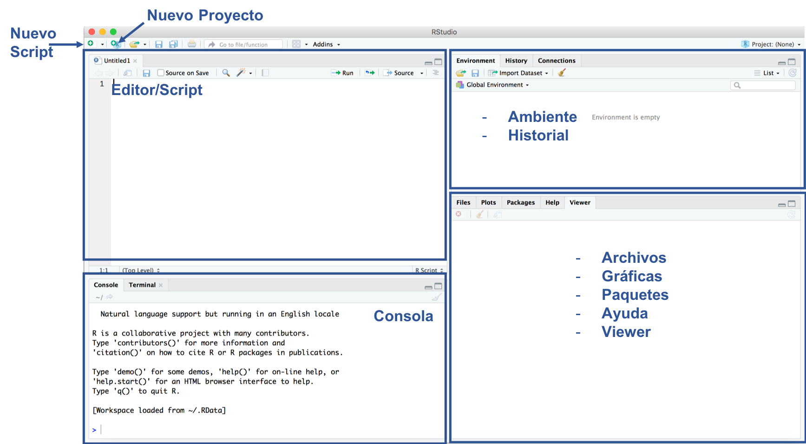
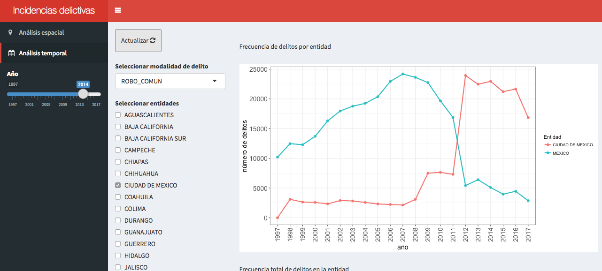
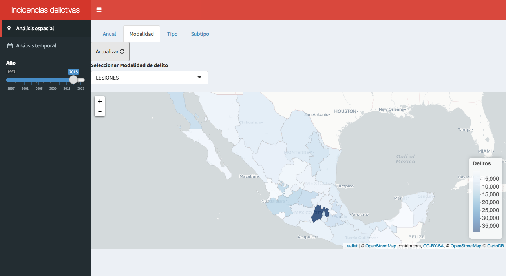
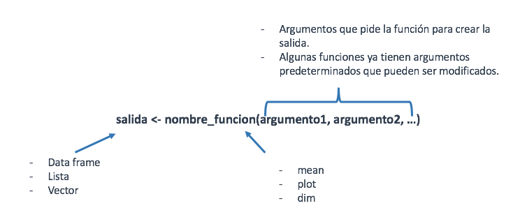
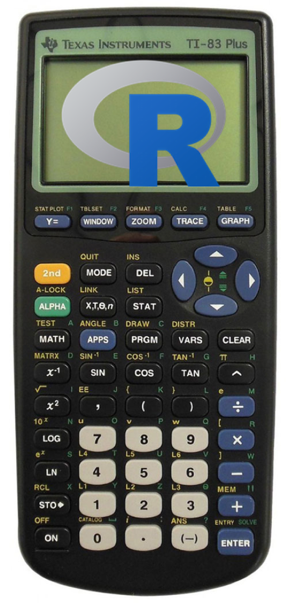
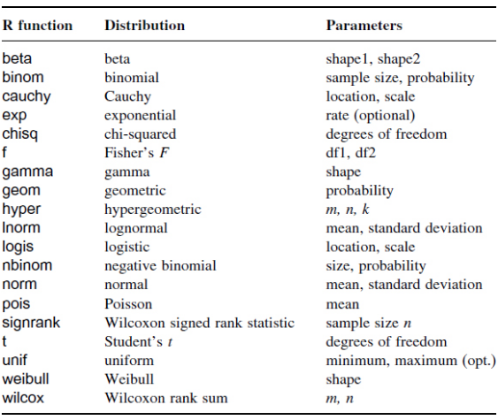

```{r setup, include=FALSE}
library(learnr)
library(ggplot2movies)
knitr::opts_chunk$set(echo = TRUE)
```


## Introducción

### R y RStudio

[R](https://cran.r-project.org/) es un lenguaje de programación estadístico.
Facilita la manipulación de los datos, la simulación de eventos aleatorios empleando
varias distribuciones, la generación de gráficos, entre un sin fin de aplicaciones.

Este taller tiene como objetivo presentar un primer acercamiento a R,
exponiendo algunas de sus principales funciones.
20 funciones base y cada una tiene funciones relacionadas con la misma

R se usa desde la terminal, pero existen interfaces gráficas que facilitan su uso.
La más popular es [RStudio](https://www.rstudio.com/),
ya que incorpora varios elementos en una sola ventana, como gráficos, directorios,
variables y otros. Una de las ventajas de usar esta interfaz es que es homogénea
a lo largo de los sistemas operativos.

Para empezar a escribir código en R, primero instalamos R desde el CRAN y después RStudio. CRAN es una red de servidores alrededor del mundo que contiene las 
versiones y documentación actualizadas de R.

{width=700px}

### Motivación

R es muy flexible y puedes llegar desarollar cosas tan elaboradas como: libros, 
aplicaciones web, vinculación con otros lenguajes de programación, modelos estadísticos robustos, simulaciones complejas, etc.

{width=600px}

<br/>

{width=600px}

<br/>

Todo esto es posible gracias a que R es de código abierto, es decir, podemos modificar la fuente del programa sin restricciones de licencia, a diferencia de muchos
lenguajes que encierran su código y restringen los derechos de los mismos.

Además R se enriquece a base de contribuciones que los usuarios hacen por medio de
paquetes. Un paquete es una colección de funciones documentadas sobre un tema en particular. Por ejemplo, `ggplot2` es un paquete para generar gráficos basado en
_The Grammar of Graphics_, o `shiny` que se utiliza para crear aplicaciones web
como las de las imágenes anteriores o este taller. 

## 0. ¿Qué es una función en R? 

Las funciones en R realizan una acción a partir de ciertos argumentos,
como calcular un promedio, leer una base de datos, etc. R cuenta 
con varias funciones pre-cargadas y se puede tener acceso a muchas más instalando
paquetes. La estructura general de una función en R se muestra en la siguiente
imagen:

{width=600px}


## 1. Funciones básicas

### ¿Cómo puedo encontrar ayuda dentro de R?

 _**Función 1: `help`**_


```{r echo=TRUE}
help('mean')
?mean()
help.search('variance')

```

### Directorio de trabajo

R trabaja apuntando al directorio en nuestra computadora.

 _**Función 2: `getwd`**_

Utilizamos esta función para saber en qué directorio estamos trabajando. `getwd`
no necesita de argumentos. 

```{r}
getwd()
```

Para cambiar el directorio, tenemos que especificarlo como argumento en la función
`setwd`.

```{r eval=FALSE}
setwd("ruta_de_directorio")
```

### Comentarios

R usa el signo `#` para añadir comentarios, para que tú y otros puedan
enteder de qué se trata el código. Los comentarios no se corren como código, 
por lo tanto no tendrán influencia en el resultado. 


*Ejemplo del uso de `#`*


```{r five-plus-four, exercise=TRUE}
5 + 8
#5 + 4
```

 _**Función 3: `install.packages`**_

Como mencionamos antes, una de las principales ventajas de [R](https://cran.r-project.org) es que
la comunidad aporta por 
medio de paquetes que dan funcionalidad adicional a R base. 

Podemos instalar paquetes por medio de la función `install.packages()`. 
Por ejemplo, si quiero instalar `ggplot2` escribiría:

```{r, eval = FALSE}
install.packages("ggplot2")
```


Una vez que instalamos un paquete, queda guardado en nuestra computadora.
Cada vez que queramos hacer uso de él tenemos que llamarlo con la función 
`library()`.

```{r}
library(ggplot2)
```


## 2. R como calculadora


### Aritmética en R

R puede ser utilizado como si fuera una calculadora.

{width=200px}

+ Suma `+`

```{r echo=TRUE}
5 + 5
```

+ Resta `-`

```{r echo=TRUE}
10 - 3
```

+ Multiplicación `*`

```{r echo=TRUE}
3 * 4
```

+ División `/`

```{r echo=TRUE}
25 / 7
```

+ Potencia `^`

```{r echo=TRUE}
2^3
```

+ Raíz `sqrt()`

```{r  echo=TRUE}
sqrt(49)

```

+ Modulo `%%`

```{r echo=TRUE}
8 %% 2
```

También están disponibles las funciones trigonométricas: `sin`, `cos`, etc.

*Extra: la función `round()` sirve para redondear valores numéricos.*

```{r}
round(sqrt(2), 2)
```

<br/>

**_Ejercicio:_ Calcula la raíz del promedio entre 5 y 7.**

```{r ejpromedio, exercise=TRUE}


```

```{r ejpromedio-solution}
sqrt((5 + 7) / 2)
```


## 3. Creación de variables

### Asignación de variables

 _**Función 4: `<-`**_

Una variable permite guardar un valor u objeto. Después se puede usar el
nombre de las variables para facilmente obtener el 
valor u objeto contenido en ella. La asignación se hace a través del
operador `<-`.

Con el _shortcut_ **alt** + **-** podemos generar `<-`.

```{r}
mi_variable <- 5 
```

Para imprimir el valor de una variable basta con llamarla con el nombre que 
le asignamos.

```{r}
mi_variable
```

Supongamos se tiene la información de las distintas frutas que se compraron:

```{r}
higos <- 20
naranjas <- 7
manzanas <- 5
limones <- 9
```

Con el nombre de las variables podemos saber el total de fruta que se tiene

```{r}
frutas <- higos + naranjas + manzanas + limones
frutas
```


En R hay varios tipos de objeto, los principales son:

- `integer`: número entero
- `double`: número con precisión de punto flotante
- `character`: cadena de caracteres
- `logical`: booleano (TRUE, FALSE)

Algunos tipos especiales son:

- `NA`: valor faltante
- `NULL`: valor no definido
- `Inf`: resultado de dividir entre 0
- `NaN`: resultado de una operación no definida (0/0)

<br/>

**_Ejercicio:_ Crea una variable que se llame `mi_edad` y asígnale el valor de tu edad. Después, imprime el valor de la variable. **

```{r ejedad, exercise=TRUE}


```

```{r ejedad-solution}
mi_edad <- 28
mi_edad
```

<br/>

<style>
div.blue { background-color:#e6f0ff; border-radius: 5px; padding: 20px;}
</style>
<div class = "blue">


**_Nota:_** Te sugerimos que los nombres de variables los escribas con letras minúsculas,
números y `_`. Usa los guiones bajos (`_`) para separar palabras dentro del nombre.
Nos basamos en la guía de estilo de Hadley Wickham, aunque tú puedes usar otra forma,
solo procura ser consistente a lo largo de tu código.
Recuerda que R es sensible a mayúsculas y minúsculas.

</div>

<br/>

Elemplos:

```{r, eval=FALSE}

# Bien
day_one
day_1

# Mal
DayOne
dayone

```


## 4. Vectores


Un vector es una secuencia de elementos del mismo tipo. Los elementos de un
vector se llaman componentes.


### Creación de vectores

 _**Función 5: `c`**_

Podemos generar vectores a través de diversas funciones,

`c()`: sirve para concatenar elementos. Los argumentos son los componentes de
nuestro vector.

```{r}
x <- c(7, 11, 13)
x
```


`:`: genera una secuencia de números enteros. Necesitamos indicarle el inicio
y fin de nuestra secuencia.

```{r}
x <- 1:10
x
```

Si el número de inicio es mayor al de fin, genera la secuencia de manera 
descendente.

```{r}
10:1
```

`seq()`: para crear secuencias más complejas. Tiene varias modalidades,

  + Indicar el tamaño de salto con el argumento `by`

```{r}
x <- seq(from = 0, to = 1, by = 0.1)
x
```

  + Indicar la longitud de la secuencia usando el argumento `length.out`

```{r}
x <- seq(from = 0, to = 1, length.out = 3)
x
```

`rep()`: crea un vector a partir de repeticiones de los componentes de otro.


 + Se puede repetir el vector completo tantas veces queramos con el argumento
 `times`.

```{r}
x <- rep(1:4, times = 3)
x
```

  + O bien, repetir elemento por elemento usnado el argumento `each`.
  
```{r}
x <- rep(1:2, each = 3)
x
```

`sample()`: Para generar vectores aleatorios a partir de muestras de otro. Tenemos
que darle como argumentos el vector del que se tomará la muestra y el tamaño de la misma.

De manera predeterminada el muestreo se hace sin reemplazo.

```{r}
sample(1:100, size = 10)
```

Si queremos hacer la muestra con reemplazo, usamos el argumento lógico `replace`

```{r}
sample(1:100, size = 30, replace = TRUE)
```


También podemos crear vectores a través de la unión de otros, para esto
volvemos a hacer uso de la función `c()`.


```{r}
x <- c(18, 23, 59)
x
y <- c(1:5, x)
y
```


En R existen algunos vectores de caracteres previamente cargados:

 + `letters`: 26 letras del alfabeto en minúsculas
 + `LETTERS`: 26 letras del alfabeto en mayúsculas
 + `month.name`: nombres de los meses en inglés
 + `month.abb`: la abreviatura de 3 letras de los meses en inglés
 
```{r}
letters
LETTERS
month.name
month.abb
```


 
### Identificar el tipo de un vector


 _**Función 6: `str`**_

La función `str()` podemos conocer la estructura de un vector.
Esta función es de las más usadas en R y nos servirá para otras estructuras de datos,
no solo para vectores.


```{r}
y <- c("Mariana", "Juanito", "Luis")
str(y)
```

```{r}
z <- 1:4
str(z)
```

```{r}
x <- c(1,2,'hola', TRUE)
str(x)
# ¿Por qué?
```

Tambien existe la función `class()`, la cual devuelve únicamente el tipo de objeto.

```{r}
class(z)
```

<br/>
**_Ejercicio:_ Crea una secuencia de números impares que vaya del 11 al 21 e imprime de qué tipo es. **

```{r ejvectores, exercise=TRUE}


``` 

```{r ejvectores-solution}
# Solución 1:
secuencia <- seq(11, 21, by = 2)
secuencia
class(secuencia)

# Solución 2
class(seq(11, 21, by = 2))

```

## 5. Funciones para vectores

### Reordenar un vector

 _**Función 7: `sort`**_

La función `sort()` regresa los elementos del vector ordenados de menor a mayor.

```{r}
x <- c(4,2,8,11,1,30,11.5)
sort(x)
```

Con el argumento `decreasing` podemos decirle que necesitamos que el orden sea de mayor a menor.

```{r}
x <- c(4,2,8,11,1,30,11.5)
sort(x, decreasing = TRUE)
```


Usando la función `rev()` obtenemos un vector con el orden de los elementos invertido.


```{r}
x <- c(5, 3, 7, 9)
rev(x)
```
<br/>
**Ejercicio: Crea un vector que se llame `series` y contenga una serie que va del 3 al 9 de uno en uno y otra del 10 al 40 con saltos de tres. Después invierte el orden del vector. **

```{r ejorden, exercise=TRUE}


``` 

```{r ejorden-solution}
series <- c(3:9, seq(10, 40, by = 3))
series
rev(series)

```


### Características de un vector

 _**Función 8: `length`**_

La función `length()` sirve para conocer la longitud de un vector.


```{r}
x <- c(rep(1:2, each = 3), rep(8:10, times = 2), 4, 5 ,2)
x
length(x)
```


Cuando nos interesa saber cuáles son los elementos únicos, usamos la función `unique()`.

```{r}
unique(x)
```

Ya que sabemos los diferentes elementos de un vector, seguiría saber cuántos hay de
cada uno. Para esto existe la función `table()` que nos regresa una tabla de 
frecuencias.


```{r}
table(x)
```
<br/>

**Ejercicio: Construye un vector que se llame `volado` que sea de tamaño 50 y sea creado a partir de una muestra de las palabras "águila" y 'sol. Después haz una tabla de frecuencias del vector.**

```{r ejvolado, exercise=TRUE}


``` 

```{r ejvolado-solution}
volado <- sample(c('águila', 'sol'), size = 50, replace = TRUE)
table(volado)
```


### Índices de un vector

En R cada elemento de un vector tiene una posición. El primer componente de un
vector tiene la posición 1, a diferencia de otros lenguajes que empiezan en 0.
Entonces si queremos ver el tercer elemento de un vector, haremos referencia al
elemento en la posicion 3. Por medio de `[ ]` tenemos acceso a los elementos
dentro de un vector.


```{r}
y <- seq(1:20)
y[5]
y[3]
```


Si queremos omitir algún elemento, indicamos su posición con signo negativo.

```{r}
y[-5]
y[-3]
```

Cuando lo que nos interesa son varios elementos, dentro de los corchetes 
incluímos un vector con las posiciones deseadas.

```{r}
y[4:8]
y[c(3,7)]
```

De manera análoga, si quieremos ver el vector sin un subconjunto de elementos, 
indicamos las posiciones con signo negativo.

```{r}
y[-(3:6)]
y[-c(1,length(y))]
```


*¿Qué pasa si le pedimos una posición que se sale de la longitud del vector?*

<br/>

**Ejercicio: Crea un vector que se llame `z` que contenga una secuencia que empiece en 5, que vaya en saltos de 0.25 de longitud 8 e imprime el último elemento.**

```{r ejpos, exercise=TRUE}


``` 

```{r ejpos-solution}
z <- seq(5, by = 0.25, length.out = 8)
z[length(z)]
```

### Selección de elementos

 _**Función 9: `which`**_

En ocasiones no conocemos la posición exacta en la que está almacenado el valor
que nos interesa. En estos casos hacemos uso de la función `which()`, nos ayuda a encontrar
las posiciones de los elementos que cumplen la condición que buscamos.


```{r}
y
which(y < 10)
```

De manera similar, si queremos conocer en dónde están guardados el mínimo y el máximo 
usamos las funciones `which.min()` y `which.max()`.

```{r}
which.min(y)
which.max(y)
```

Conociendo las posiciones de los elementos que nos interesan, podemos utilizarlas
para extraer a dichos elementos.

```{r}
y[which(y > 10)]
y[which(y == 10)] # "==" sirve para comparar si un elemento es igual a otro
y[which(y != 10)] # "!=" compara si los elementos son distintos
```

Una función que también nos ayuda a extraer subconjuntos de un vector que cumplen
cierta condición es `subset()`.

```{r}
subset(y, y > 10)
```

Estas funciones operan de manera similar cuando se trata de vectores de caracteres:

```{r}
pan <- c('dona', 'oreja', 'concha', 'chocolatin')
pan[pan == 'dona']
pan[pan == 'bolillo'] # ¿Qué pasa?
```

<br/>

**Ejercicio: ¿En qué posición está la letra L en el alfabeto? Utiliza el vector `LETTERS` para encontrarla.**

```{r ejseleccion, exercise=TRUE}


``` 

```{r ejseleccion-solution}
which(LETTERS == 'L')
```

### Operaciones con vectores

En R, las operaciones aritméticas con vectores se realizan componente a componente.

```{r}
x <- c(2,4,6)
y <- c(10,8,5)
z <- rep(2, times = 5)

x + y
x - y
x*y
x/y
exp(x)

```

Para el producto punto se utiliza el operador `%*%`.

```{r}
x %*% y
```


Si realizamos una operación con vectores que no tienen la misma longitud, R
recicla los valores del vector de longitud menor hasta coincidir con la longitud del
vector más grande. (Además nos regresará un warning).


```{r}
y + z
```

También podemos hacer operaciones lógicas componente a componente. Los operadores
que se utilizan son los siguientes:

  - `==`: evalúa igualdad
  - `!=`: evalúa desigualdad
  - `<`, `>`, `<=`, `>=`: menor, mayor, menor que y mayor que
  - `%in%`: evalúa pertenencia
  
Ejemplos de uso:

```{r}
x <- 1:5
y <- 2:6

x %in% y
x == y
```

<br/>

**Ejercicio: Del vector `pan`, encuentra para qué posiciones se cumple que contienen las palabras "dona" y "chocolatin".**

```{r ejpan, exercise=TRUE}
pan <- c('dona', 'oreja', 'concha', 'chocolatin')

``` 

```{r ejpan-solution}
pan <- c('dona', 'oreja', 'concha', 'chocolatin')
pan %in% c('dona', 'chocolatin')

```

### Funciones estadísticas

 _**Función 10: `mean`**_

Para conocer los estadísticos resumen de un vector, existen varias funciones
en R base que nos ayudan a obtenerlos.

<br/>

<style>
div.blue { background-color:#e6f0ff; border-radius: 5px; padding: 20px;}
</style>
<div class = "blue">


**_Nota:_** Si colocamos entre paréntesis la asignación de una variable, se imprime el resultado
de la asignación.

</div>

<br/>

```{r}
set.seed(19900707)
(w <- sample(2:50, size = 20, replace = TRUE))

(z <- sample(30:80, size = 20, replace = TRUE))


mean(w) # Media
max(w) # Máximo
min(w) # Mínimo
median(w) # Mediana
var(w) # Varianza
sd(w) # Desviación estándar
sum(z) # Suma
cumsum(z) # Suma acumulada

```


Si queremos obtener los cuantiles de un vector, utilizamos la función `quantile`.
En el argumento `probs` indicamos los cuantiles que nos interesan a manera de vector.
En caso de no utilizar este argumento, nos regresa los cuantiles 0, 0.25, 0.5, 0.75 y 1.

```{r}

quantile(w, probs = c(0.1, 0.9))
quantile(w, probs = seq(0, 1, by = 0.1))
quantile(w)

```

Calculamos la correlación entre dos vectores con la función `cor()`.

```{r}
cor(w, z)
```


<br/>

**Ejercicio: Calcula el promedio y desviación estándar de los números del 1 al 100.**

```{r ejmedia, exercise=TRUE}


``` 

```{r ejmedia-solution}
mean(1:100)
sd(1:100)

```


## 6. Distribuciones de probabilidad

 _**Función 11: `rnorm`**_

R cuenta con funciones que nos permiten generar vectores a partir de distribuciones
de probabilidad. Cada distribución tiene 4 funciones, las cuales están compuestas
por la raíz del nombre de la distribución, por ejemplo, en el caso de la normal es _norm_.
Estas raíces tienen como prefijo 4 letras de acuerdo a lo que buscamos obtener.

   + `p`: probabilidad. Función de distribución acumulada.
   + `q`: cuantil. Inversa de la distribución acumulada.
   + `d`: densidad. Función de densidad.
   + `r`: simulación (random). Genera números aleatorios a partir de una distribución en particular.
   
Los argumentos de cada una de estas funciones varían de acuerdo a la distribución 
con la que queremos trabajar, ya que dependen de los parámetros de esta.
Veremos su uso tomando como ejemplo la distribución normal, ya que es la más común.
Los argumentos en este caso son la media y la desviación estándar, `mean` y `sd`,
respectivamente.


```{r}
pnorm(0, mean = 0, sd = 1)
qnorm(0.95, mean = 0, sd = 1)
dnorm(-0.5, mean = 0, sd = 1)
rnorm(n = 10, mean = 2, sd = 3)
```


A continuación vemos las raíces para algunas de las distribuciones más usadas:




<br/>

<style>
div.blue { background-color:#e6f0ff; border-radius: 5px; padding: 20px;}
</style>
<div class = "blue">


**_Nota:_** Es importante fijarnos en la documentación para ver la parametrización que se 
está utilizando.

</div>

<br/>


**Ejercicio: Genera 1000 números a partir de una distribición normal con media 20 y desviación estándar 10 y comprueba que su media es aproximadamente 20.**

```{r ejnormal, exercise=TRUE}


``` 

```{r ejnormal-solution}
sim_normal <- rnorm(1000, 20, 10)
mean(sim_normal)

# Otra solución sería:
mean(rnorm(1000, 20, 10))

```


## 7. Matrices y Listas

Aunque no nos enfocaremos en este tipo de estructuras, es importante conocerlas.

Hasta ahora hemos trabajado con objetos de una sola dimensión.


 _**Función 12: `matrix`**_

Las matrices son estructuras de datos de dos dimensiones. 
Una matriz se define con la función `matrix()`.

La lista es una estructura de datos de una dimensión que permite 
distintas clases de elementos en el objeto. La 
función `list()` permite crear objetos de esta clase.

{width=600px}

## 8. Data Frames

Un _data frame_ es una estrucura de dos dimensiones que se utiliza para
guardar tablas de datos. Es una lista de vectores de la misma longitud.

 _**Función 13: `data.frame`**_

Podemos crear un _data frame_ a través de la función `data.frame()`.
Los argumentos de la función son los elementos (columnas) de nuestra tabla de datos.


```{r}
n <- 1:3
s <- letters[1:3]
b <- c(TRUE, FALSE, TRUE) 
df <- data.frame(n, s, b) 
df
```


En R exsiten varios _data frame_ precargados con los que podemos empezar
a explorar este tipo de objetos sin tener que importarlos o crearlos.

Para motivos de este taller utilizaremos la base `movies` que se encuentra 
dentro del paquete __ggplot2movies__.


### Explorar un data frame

Primero instalamos el paquete `ggplot2movies` para explorar los datos
de la base `movies`.

```{r, eval=FALSE}
install.packages("ggplot2movies")
```
```{r}
library(ggplot2movies)
```

 _**Función 14: `head`**_

Muestra las primeras seis observasiones (filas) de la base.

```{r}
head(movies)
```

Tiene la opción de poder indicar cuántas observaciones se quieren ver a través
del argumento `n`.

```{r}
head(movies, n = 10)
```

De manera análoga, la función `tail` muestra las últimas seis observasiones
(filas) de la base.

```{r}
tail(movies)
```

Al igual que `head`, `tail` tiene la opción de poder modificar le número de
observaciones que queremos ver.

```{r}
tail(movies, 10)
```


<br/>

<style>
div.blue { background-color:#e6f0ff; border-radius: 5px; padding: 20px;}
</style>
<div class = "blue">


**_Nota:_** Si queremos visualizar los datos de una manera más amigable, podemos
hacer uso de la función View, la cual despliega una nueva pestaña con los datos
a manera de "hoja de Excel".

</div>

<br/>


```{r, eval=FALSE}
View(movies)
```


 _**Función 15: `summary`**_

`summary()` regresa un resumen estadístico general cuando se trata de columnas numéricas.
Si se trata de caracteres, nos dice la longitud y si hay presencia de datos
faltantes. (También podemos utilizar esta función con vectores.)

```{r}
summary(movies)
```

Como vimos previamente, `str` nos regresa información sobra la estructura de 
un objeto.

```{r}
str(movies)
```

Para conocer cuantas filas y columnas tiene nuestro _data frame_, usamos la
función `dim()`.

```{r}
dim(movies)
```

### Moverse en un data frame

Al igual que en el caso de vectores, con los _data frame_ usamos `[ ]` para
tener acceso a sus elementos. En este caso tenemos que indicar tanto las
filas como las columnas.

*`dataframe[filas, columnas]`*

  + Elegir una fila:

```{r}
movies[10,]
```

  + Elegir una columna

```{r}
head(movies[,1])
```

  + Elegir una fila y algunas columnas

```{r}
movies[12, c(1,2,6)]
```

  + Elegir ciertas filas y columas
  
```{r}
movies[12:20, c(1,2,6)]
```


Otra manera de extraer una columna del _data frame_ es a través de su nombre
utilizando el signo: `$`


```{r}
head(movies$title)
```

Esto nos permite trabajar con las columnas como si fueran vectores.

```{r}
mean(movies$rating)
```


Para extraer un subconjunto del _data frame_ usamos la función `subset()`.
Le damos como primer argumento el _data frame_ y como segundo argumento la condición
que queremos filtrar.


```{r}
drama <- subset(movies, Drama == 1)
head(drama)
```


<br/>


**Ejercicio: Obtén el promedio de la variable `votes` del _data frame_ `movies`.**

```{r ejvotes, exercise=TRUE}


``` 

```{r ejvotes-solution}
mean(movies$votes)

```


<br/>

### Transformar un data frame

 _**Función 16: `within`**_

`within()` nos ayuda a crear nuevas columnas en un _data frame_. Tenemos 
que darle como primer argumento el _data frame_ y como segundo, entre llaves, las expresiones
que van a crear las nuevas variables.

```{r}

m <- within(movies, {     # Podemos agregar varias columas
    horas = length/60
    rating_centrado = rating - mean(rating)
    rating_est = rating_centrado/sd(rating)  # Podemos usar una columna que ya creamos

})

head(m)
```


`with()` es similar a `within()`, sin embargo esta no modifica nuestro _data frame_
solo nos regresa el vector de las variable que creamos.


```{r}
m <- with(movies, {
  suma = r1 + r2
})

head(m)
```

La instrucción anterior es equivalente a:

```{r}
m <- movies$r1 + movies$r2

head(m)
```

Una manera distinta de agregar nuevas columnas a nuestro _data frame_ es
haciendo uso del signo `$`, además del comando de asignación `<-`.


```{r}
movies$length_horas <- movies$length/60
head(movies)
```

<br/>

**Ejercicio: Utilizando la función `within` crea una nueva columna usando el _data frame_ `movies` que se llame `votes_perfil` que contenga la variable `votes` dividida entre su media. Al hacer esto perfilamos la variable de manera que las películas que tienen un número de votos mayor al promedio tendrán valores por arriba de 1 y menor a uno cuando están por debajo del promedio. Imprime los primeros renglones. Después saca el rango de `votes` y la nueva variable usando la función `range`.**

```{r ejpelis, exercise=TRUE}


``` 

```{r ejpelis-solution}
movies_mod <- within(movies, {
  votes_perfil <- votes/mean(votes)
})

head(movies_mod)

range(movies_mod$votes)

range(movies_mod$votes_perfil)

```


### Leer un data frame desde un archivo
 _**Función 17: `read.table`**_

En la mayoría de las ocasiones, tenemos que hacer uso de datos de fuentes externas.
La función `read.table()` nos ayuda a leer archivos de texto con distintas
delimitaciones, por ejemplo: ";", ",", "|".

Los argumentos más comunes de esta función es `header` para indicar si nuestros
datos tienen nombres de columna y `sep` para indicar cómo están delimitados. Además
de `file` en donde indicamos la ruta en donde está almacenada la información.

Ejemplo:

```{r}
tabla <- read.table(file = "http://allman.rhon.itam.mx/~ebarrios/EstadisticaDescriptiva/cableTV.dat", 
                    header = TRUE)
head(tabla)
```


Para leer archivos con extensión .xls o .xlsx, existen algunos paquetes como 
`readxl` y `openxlsx`. Para archivos de SPSS, SAS, Stata y Minitab existe el
paquete `haven` y `foreign`.

## 9. Gráficas


 _**Función 18: `plot`**_


En R existen paquetes que nos ayudan a generar gráficas sofisticadas, como son
__ggplot2__ y __Plotly__. Sin embargo, R base cuenta con funciones para crear
gráficas de manera sencilla, como es el caso de `plot()`.

La función `plot()` tiene como argumentos básicos el eje `x` y `y`.


```{r}
plot(x = movies$rating, y = movies$votes)
```

Otras funciones para graficar datos numéricos son `hist()` y `boxplot()` que 
generan histogramas y diagramas de caja, respectivamente.

```{r}
hist(movies$rating)
boxplot(movies$rating)
```

Para conocer como podemos hacer modificaciones sobre la apariencia de una gráfica podemos
consultar la ayuda de la función.

```{r, eval = FALSE}
?plot
```

Profundizaremos más sobre visualización de datos en la siguiente sesión.

## 10. if, while, for

 _**Función 19: `if`**_

Cuando queremos programar rutinas hacemos uso de estruturas condicionales y de ciclos (_loops_).

  + La estructura de un `if` en R es como sigue:

```{r, eval = FALSE}
if (test_expression) {
statement
}
```

Ejemplo:


```{r}
x <- 5

if(x > 0){
print("Positivo")
}

```

+ La estructura de un `if...else`:


```{r, eval = FALSE}
if (test_expression) {
statement1
} else {
statement2
}
```


Ejemplo:

```{r}
x <- -5

if(x > 0){
  
print("No negativo")
  
} else {
  
print("Negativo")
  
}
```


+ La estructura de un `for`:


```{r, eval = FALSE}
for(i in 1:n) {
  expression
}
```

Ejemplo:


```{r}
nombres <- c("Teresa", "Mariana", "Juan", "Mario", "Luis")

for(i in 1:length(nombres)) {

  print(nombres[i])
  
}

```


+ La estructura de un `while`:

```{r, eval = FALSE}

while(test_expression) {
  expression
}
```

Ejemplo:

```{r}
x <- 1
while(x < 5) {
  x <- x + 1
  print(x)
}
```


## 11. Funciones para cadenas de caracteres

 _**Función 20: `paste`**_

La función `paste()` convierte a sus argumentos en caracteres y los concatena.
El argumento `sep` sirve para indicarle cuál será el separador entre los caracteres.

```{r}
paste("hola", 1000, "adiós", sep = "-")
```

Si usamos vectores, nos regresa un vector concatenado:

```{r}
paste(1:5, letters[1:5], sep = "")
```

Una función adicional que es muy útil cuando estamos trabajando con
cadenas de caracteres es `grep()`. Nos ayuda a indentificar si una cadena
tiene algún patrón que estemos buscando.

Regresa las posiciones en el vector que cumplen la condición de contener el patrón.

```{r}
pos <- grep(pattern = "Star Wars", movies$title)
pos

# regresa los elementos del vector que contienen el patrón
movies$title[pos] 

```


<br/>

**Ejercicio: Usando las funciones que hemos visto hasta el momento, obtén un subconjunto del _data frame_ `movies` que contenga todas las películas que tengan la palabra "Alien" en el título, llámalo `movies_alien`. Después, encuentra la dimensión de este nuevo _data frame_.**

```{r ejalien, exercise=TRUE}


``` 


```{r ejalien-solution}
movies_alien <- movies[grep(pattern = "Alien", x = movies$title), ]

head(movies_alien)

dim(movies_alien)

```


## 12. Ayuda


  + [Cheatsheets](https://www.rstudio.com/resources/cheatsheets/)
  
  + [stackoverflow](https://stackoverflow.com/)
  
  + [reddit](https://www.reddit.com/r/rprogramming/)
  
  + [r-project](https://cran.r-project.org/manuals.html)
  
  + [rpubs](https://rpubs.com/)


